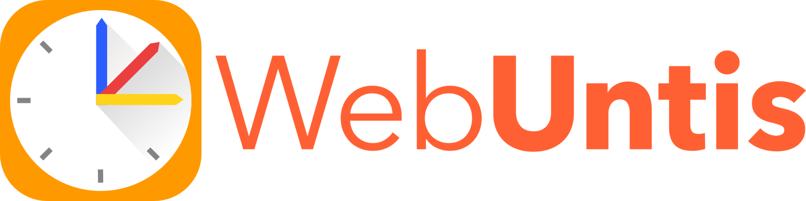
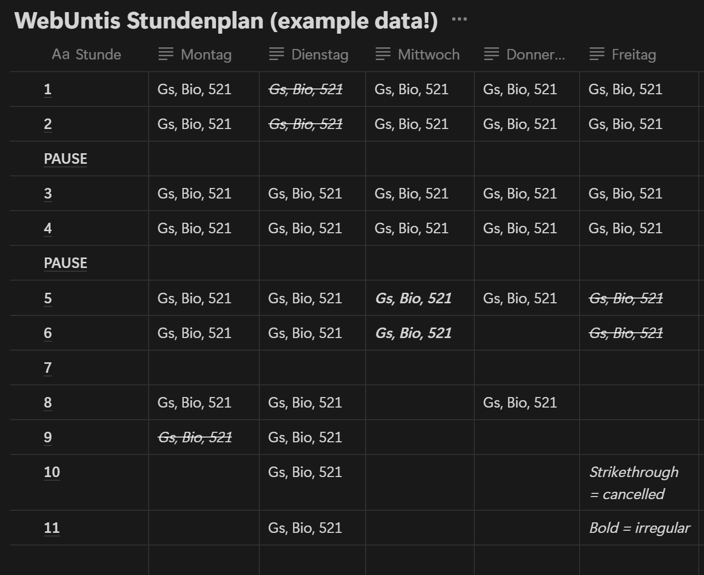
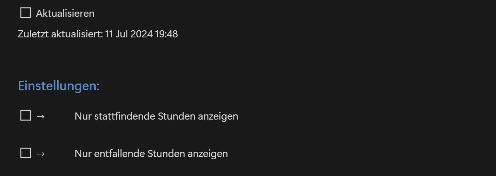

    
    

# Notion-WebUntis
Easily integrate your WebUntis timetable into your Notion Baords!
(see an example [here](#5-live-example))

## 1. Setup:

### 1.1 Workspace setup:
1. Clone / Download this repository and navigate to the directory
2. Install the dependencies using pip: `pip install -r requirements.txt`
### 1.2 Notion setup
#### 1.2.1 Notion API Setup
1. Create a new [Notion integration](https://www.notion.so/my-integrations)
2. Copy the API token into the `config.json` file
3. Duplicate the [Notion template](https://outstanding-airmail-bed.notion.site/Notion-WebUntis-3429155c2d0f4fb4a2432db400eef4e9) into your own Notion board
4. Copy the [Database ID](https://developers.notion.com/reference/retrieve-a-database) (of the database in *your* Notion board) into the `config.json` file
#### 1.2.2 Notion Block Setup
Use the tools provided in `/utils/` to retrieve the Block and Row IDs and enter them in `config.json` and `/modules/timeFormat.py`

*If you modify the structure of the database template, ensure that corresponding changes are made in `timeFormat.py`!*

### 1.3 WebUntis API setup:
1. Find out what WebUntis Server your school is running on (e.g. herakles). You can do that by logging into WebUntis on the website *(not the App!)* and looking at the subdomain (e.g. *herakles* .webuntis.com). Then copy the URL in the `config.json` file in the following format: `SERVER.webuntis.com`

    You can do this by logging into your WebUntis account on the [WebUntis Website](https://webuntis.com/) and checking the URL
2. Enter your WebUntis credentials and school- and class name into `config.json`
3. Adjust `subjects.json` to match your classes with the names they have been given on WebUntis
4. Adjust `timeFormat.py` to match the class times at your school

*You might need to speak with your schools IT department first to get the rights to use the API!*

## 2. Usage:
After completing the steps listed in [Setup](#setup), you have two options:

1. `update.py` : This script simply updates the timetable once
2. `main.py`: This script runs constantly and updates the timetable as soon as the user checks a checkbox on the Notion page

*If you want the program to automatically update the timetable at regular intervals (aka constantly run `main.py`), you will need to check with your school's IT department first to avoid any rate limits or even slowing down WebUntis for the entire school.*

*Please note that I am not responsible for any damage caused by (parts of) this project.*

## 3. Error handling:
If the Notion API returns status codes other than `200` (like most common: `400`), it is most likely caused by  the configuration in `timeFormat.py` being wrong.
Double check that the Day- and Time mapping is matching with the databse in your Notion board; especially concerning row IDs and property names. 

## 4. Development / Contributing
### 4.1 Development:
Development is currently on hold. As there is no schoollyear ongoing at the moment, I have no way to test changes.
### 4.2 Contributing:
Contributions are welcome. Please create an issue discussing what you want to change first. Once you have my approval, fork this repository and submit a pull request with your changes.

## 5. Live example
### 5.1 Example Notion page:
If you want to view the Notion page live, you can take a loook at the template [here](https://outstanding-airmail-bed.notion.site/Notion-WebUntis-3429155c2d0f4fb4a2432db400eef4e9)
### 5.2 CLI example:
Unfortunately I can't provide an example of the command line interface at the moment, as there is no school year ongoing.
I will add one as soon as I have the chance to.
### 5.3 Example screenshots of the Notion page:
The Notion database with the timetable. Format: Teacher, Subject, Room

The available settings that are changeable directly in Notion
